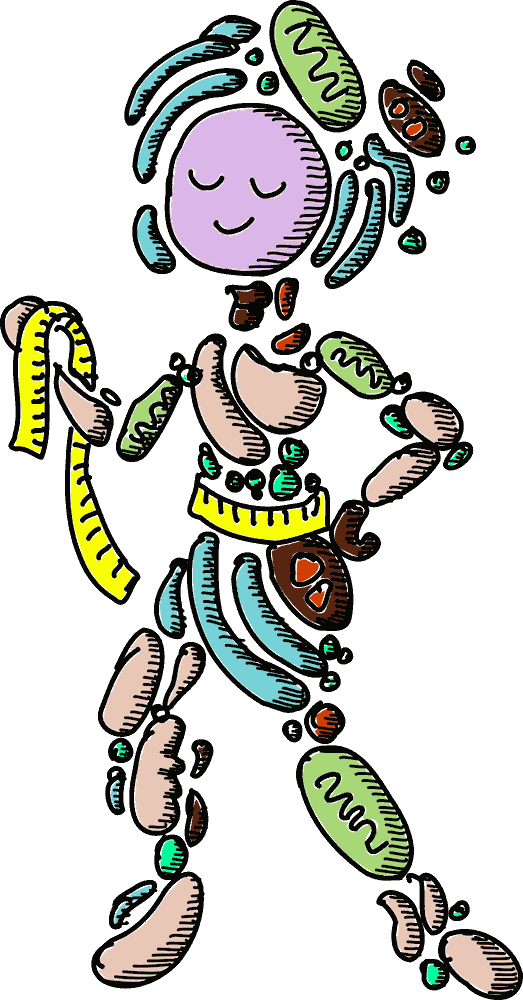
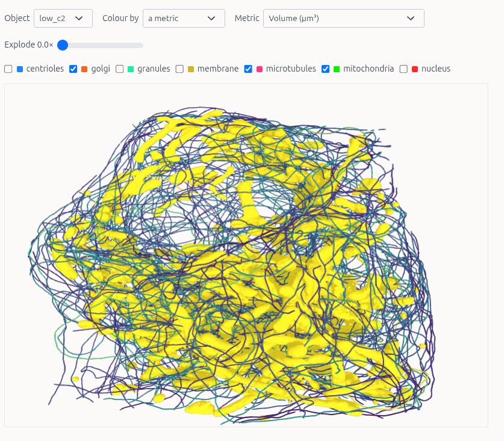
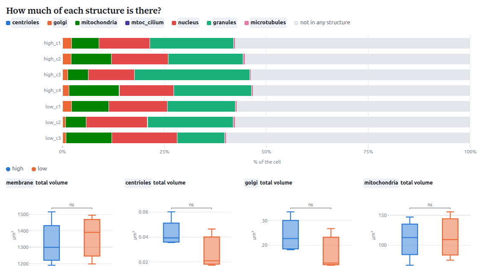
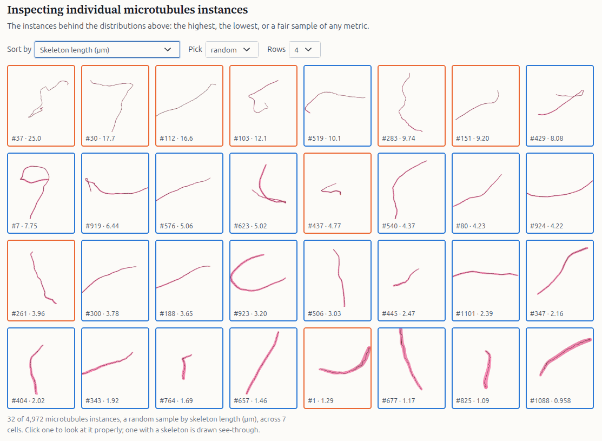

# Organella: measuring label relationships in 3D



Organella measures segmented objects - 2D or 3D, one or a batch of them - and produces a
single report you read in one standalone page: distributions, distances, contacts, and the
objects themselves in 3D.

### [Open the viewer](https://ida-mdc.github.io/organella/)

Drop a `report.parquet` on it and every chart is drawn in your browser. Nothing is uploaded
and no server runs, so a report can be mailed to a collaborator with a link to that page.

An **object** is one segmented thing measured as a whole, given as a folder: a source image,
one mask that bounds the object, and the label/mask volumes inside it. For example, object can be a cell
bounded by its plasma membrane (`--object-mask pm`). Specifying the object bound is optional. 
Everything inside is clipped to it by default, because a field of view often holds
neighbouring cells. `--no-clip` measures them anyway.

<br clear="right">

## What the report looks like



*The object itself, from the geometry a `--with-mesh` run wrote. Structures switch on and off,
colour by a metric to see where the extremes sit, and explode pushes every instance out along
its own direction from the centre.*



*How much of each structure there is, per object and per group, with Mann-Whitney brackets
between whatever the charts are faceted by.*



*The instances behind a distribution - the highest, the lowest, or a fair sample of any metric -
so an outlier can be looked at rather than guessed at.*

## Workflow

1. Organise your images in one of the [input layouts](#your-input).
2. `organella dry-run` to check what will be analysed.
3. `organella process` to write `report.parquet` and, with `--with-mesh`, the geometry.
4. `organella view` to open the report page on it.
5. Optionally import an object's geometry into [Blender](#blender).

## Try it

First, [install uv](https://docs.astral.sh/uv/getting-started/installation/) (or install the package via pip without uv, but uv is cool).

Next, install Organella:

```bash
uv pip install "organella @ git+https://github.com/ida-mdc/organella.git@main"
```

Then test, measure, and view your label dataset:

```bash
organella dry-run experiment/
organella process experiment/ -o report.parquet --with-mesh
organella view report.parquet
```

The handful of arguments worth knowing from the start:

| | |
| --- | --- |
| `--object-mask pm` | the mask that bounds each object. It decides the origin of every distance and polarity, and everything inside it is clipped to it, so it is never guessed - `dry-run` lists the masks each folder has |
| `-p control -p treated` | subdirectories to import as groups. That grouping becomes the default comparison in every chart |
| `--voxel-size-um 0.1,0.02,0.02` | needed when the images carry no calibration, since a size is never invented. `y,x` for a plane |
| `--skeletons mito,ER` | branches, length and tortuosity for the structures worth it. Opt-in: it is the most expensive thing in a run |
| `--entities mito,ER` | measure only these. Each entity is another full-size channel, so a subject carrying 117 structures needs this to fit in memory |
| `--with-mesh` | also write the geometry the 3D sections and Blender read, to `<output>_meshes/` |

Every argument is listed under [Parameters of `process`](#parameters-of-process).

**Check the input first.** `dry-run` reads image headers only - no analysis, no output - 
and prints per object the source image, the label and mask entities
found (`*` marks the object mask), and anything that looks wrong. Then which entities are
missing in which objects, and a suggested `--max-workers`. Exit code is `1` if any object
cannot be analysed.

```text
control/cell_b
  source  sample_b.tif   [12.4 MB stacked]
  labels  mito
  masks   nucleus, pm*
  warn    ignored readme_overlay.tif: not <prefix>_<name>_label|labels|mask

===== 3 object folder(s) =====  (* = object mask)
  label:mito               2/3   ← missing in some objects
  mask:pm                  3/3
```

## Reading the report

`organella view report.parquet` serves the report, its geometry and the page from one
localhost origin and opens it. Or open **<https://ida-mdc.github.io/organella/>** and drop
`report.parquet` on it: the page parses the parquet in the browser, so nothing is uploaded and
no server runs.

**The 3D sections need the geometry too**. Press **Add geometry** and pick either the `report_meshes` folder or the
`geometry.parquet` files themselves; The `organelle view` command attaches them for you and you don't need to do anything else.

In the page, **Charts** switches every panel between boxes and histograms, and
**Significance** puts Mann-Whitney brackets between whatever the charts are faceted by. Every
column carries its own description in the report, so the page explains each metric under the
chart of it.

## Your input

Entity files must match `<prefix>_<name>_label.tif` (or `_labels.tif`) and
`<prefix>_<name>_mask.tif`, where `<prefix>` is the source image basename. The prefix is taken
off the front, so the entity name is whatever is left and may have underscores in it:
`s0011_rib_left_11_mask.tif` is the entity `rib_left_11`.

```text
my_cell/
  sample.tif
  sample_mito_label.tif
  sample_nucleus_mask.tif
  sample_membrane_mask.tif
```

An object folder can sit on its own, in a flat batch (`cells/cell_a/`, `cells/cell_b/`), or in
a grouped batch (`experiment/control/cell_a/`, `experiment/treated/cell_b/`), where the group
folder is what `-p` imports.

**Other formats.** NIfTI (`.nii`, `.nii.gz`), NRRD and MetaImage are read through SimpleITK.
Their headers carry a reliable voxel size, which TIFF often does not; spacing is read as
millimetres, the convention every reader of these files uses.
 
**Entities in a subfolder** named by nothing but the structure - a `segmentations/`, `masks/`
or `labels/` folder beside the source image. There is no prefix to strip, and label-or-mask
is read off the content rather than guessed from the name.
 
**A remote store, read as a crop.** A folder holding one `source.json` and no images names a
chunked store (N5 or Zarr, local or on S3), the arrays in it, and the window to read. A 512³
crop of OpenOrganelle's 122-gigavoxel HeLa cell is 0.64% of it, in under five seconds, at
full 4 nm resolution. Needs the `remote` extra: `pip install 'organella[remote]'`.

```json
{
  "store": "s3://janelia-cosem-datasets/jrc_hela-2/jrc_hela-2.n5",
  "scale": "s0",
  "crop": "3712:4224,256:768,5760:6272",
  "source": "em/fibsem-uint16",
  "entities": { "mito": "labels/mito_seg", "er": "labels/er_seg" }
}
```

## Output

```text
report.parquet                            # rows per object, structure, instance and contact
report_meshes/<object>/geometry.parquet   # only with --with-mesh
```

Everything measured lands in `report.parquet`, as rows at four depths told apart by `row_type`:

| `row_type` | `obs_level` | one row per |
| --- | --- | --- |
| `object` | 0 | object folder: extent, provenance, and the whole-object totals |
| `entity` | 1 | structure, by name: volume, surface area, sphericity, instance counts |
| `instance` | 2 | labelled instance: its own size, shape, polarity and nearest neighbour |
| `distance` | 2 | instance × target structure: how far that instance is from it |
| `contact` | 2 | touching pair of instances of one structure, with their gap |

Geometry goes beside the report rather than in it, because meshes would multiply the size of a
table every query loads. One `geometry.parquet` per object holds a surface per instance (an
outline, for a 2D object), the skeletons, and the touching pairs, so it stands on its own for
Blender and for a hosted copy. The object row records where, in `mesh_geometry_file`.

## Commands

| | |
| --- | --- |
| `organella dry-run DIR` | what would be analysed, from headers only |
| `organella process DIR -o REPORT` | measure a batch, write the report |
| `organella mesh DIR -o OUTDIR` | geometry only, for a report you already have |
| `organella view REPORT` | serve the report, its geometry and the page, and open it |
| `organella page` | print the path of the standalone page |
| `organella colours REPORT PALETTE` | recolour a report in about a second |
| `organella describe REPORT TEXT` | say what the data is: credits, a citation, a licence. `-` reads it from standard input |

`dry-run` takes `--object-mask NAME`, to check every folder has it rather than only listing
what they have. `view` takes `--port` (default 8052) and `--no-browser`. `mesh` takes
`-o, --out-dir` for where to write `<object>/geometry.parquet`, plus the input, geometry and
run parameters below and `--no-contacts`.

## Parameters of `process`

**Input**

| | |
| --- | --- |
| `-o, --output FILE` | where to write the report. Required |
| `-p, --paths TEXT` | subdirectory to import as its own group, repeatable. Becomes the default grouping in every chart |
| `--object-mask NAME` | the mask that bounds each object. Never guessed: it decides the origin of every distance and polarity. Left out, entities are measured where they lie |
| `--description TEXT` | what this data is and who it credits. It travels in the report, and the page shows it above the first section, so a report you send arrives with its provenance |
| `--object-noun WORD` | what one measured thing is called in the report, e.g. `cell`, or `nucleus/nuclei` for an irregular plural. Presentation only |
| `--voxel-size-um Z,Y,X` | voxel size in µm; `y,x` for a plane. Inferred from the source metadata when omitted, and refused rather than invented if there is none |
| `--entities NAMES` | measure only these, plus the object mask. Each entity is another full-size channel, so a 117-structure subject needs selecting down before it fits in memory |
| `--label-map FILE` | JSON of `{"1": "liver"}`, splitting one volume whose ids each mean a different structure into an entity per id. Only named ids become entities |
| `--label-map-entity NAME` | which entity `--label-map` splits. Needed only when a folder has more than one label entity, where leaving it out is an error rather than a guess |
| `--auto-label-masks` | promote masks with several connected components to label entities |

**What gets measured**

| | |
| --- | --- |
| `--no-clip` | measure outside the object mask too. Clipped to it by default, since that is what naming a bounding mask means |
| `--no-instances` | entity-level morphology only: no per-instance rows |
| `--no-contacts` | skip the contact rows |
| `--contact-max-um T` | largest gap between two instances of one structure that still counts as a contact. Default 0.5 |
| `--skeletons NAMES` | structures to skeletonise, for branches, length and tortuosity. Opt-in: it is the most expensive thing in a run, and a granule's skeleton is one branch the length of its diameter |
| `--max-skeleton-voxels N` | skip skeletons for instances above this voxel count. Default 500000 |
| `--polarity-spread` | also measure each instance's angular spread on the polarity sphere |
| `--distance-histograms` | also measure per-instance distance distributions, not just the minimum |
| `--colours FILE` | also `--colors`. JSON of `{"mito": "#d62728"}`. Lands in the report, so every chart draws that structure the same. Unnamed structures keep the built-in palette |

**Geometry**, all of it only with `--with-mesh`

| | |
| --- | --- |
| `--with-mesh` | also write per-object geometry for the 3D views and Blender. Goes to `<output>_meshes/`, never into the parquet |
| `--geometry-as NAME=KIND,...` | how a structure's surface is stored: `mesh`, `ellipsoid` or `tube`, e.g. `vesicle=ellipsoid`. Decided from the measured shape when unnamed - a round instance becomes a 60-byte ellipsoid, which is what makes tens of thousands drawable. No measurement changes; the surface is only ever drawn |
| `--mesh-max-vertices N` | most vertices one surface keeps; 0 lifts the cap. Default 200000. A decimation *fraction* bounds nothing: at 0.5 one ER sheet was still 2.87 million vertices and 86 MB |
| `--mesh-smooth-sigma SIGMA` | Gaussian sigma before marching cubes. Default 0.7; 0 disables |
| `--mesh-step-size N` | marching-cubes step size; 1 is full resolution. Default 2 |
| `--mesh-target-reduction F` | decimation fraction. Default 0.8, keeping ~20% of faces |
| `--mesh-level L` | iso-surface level on the signed distance field. Default 0 |
| `--mesh-surface-method` | `marching-cubes` or `surface-nets`. The dual method has ~30% less staircase noise, no fewer vertices, and is 66% slower |
| `--mesh-workers N` | processes meshing one object's instances. Default: the cores the object pool is not using |
| `--reuse-geometry` | keep any `geometry.parquet` an object already has. Meshing dominates a run, so a batch that died partway finishes in minutes |

**The run**

| | |
| --- | --- |
| `--max-workers N` | worker processes. Default: worked out from memory, since one object can need gigabytes |
| `--num-threads N` | kimimaro worker count. Default 1, because objects already run in parallel |
| `--resume` | skip objects an interrupted run already measured. Each object's rows go to `<output>_parts/` as it finishes and are removed once the report is written |

## Sharing a report

The geometry stays a folder of one file per object, so it travels with
the report in one of two shapes:

- hand over `report.parquet` and its `report_meshes/` folder, and the reader runs
  `organella view report.parquet`
- or upload the two together, unchanged, and open the page with `?data=<url of the parquet>`.
  The geometry is looked for beside the parquet as `<name>_meshes/`, so there is nothing else
  to pass. If the files sit on a different origin than the page, that server has to allow
  cross-origin requests - GitHub Pages does, a bare `python -m http.server` does not.


## Development

```bash
uv venv --python 3.12 .venv
source .venv/bin/activate
uv pip install -e '.[test]'      # the suite needs pytest and duckdb
.venv/bin/python -m pytest
```

The report page is one file with no build step, edit
[`src/organella/report/organella_report.html`](src/organella/report/organella_report.html)
and reload the browser. The test suite runs it through
node - how a report is read into it, the maths its panels draw, the queries its 3D
sections build, and every section drawn against a stub DOM:

```bash
.venv/bin/python -m pytest tests/test_report_page.py
```

That harness never runs the real load path - DuckDB-WASM, the parquet read, WebGL - so a
change to how the page opens a report has to be checked in a browser.

## Blender

`geometry_to_blender.py` imports an object's `geometry.parquet`. It needs Blender with `pandas`
and `pyarrow` in Blender's own Python
(`<blender>/python/bin/python3 -m pip install pandas pyarrow`), and geometry from a **3D**
object - a 2D object carries outlines, which the report's gallery draws and Blender has no use
for.

```bash
blender --background --python geometry_to_blender.py -- geometry.parquet [out.blend] [out.png]
```

Or open the script in Blender's Script Editor, set `GEOMETRY_PATH` (optionally `OUT_BLEND`,
`OUT_RENDER`) and run it with `Alt+P`.
